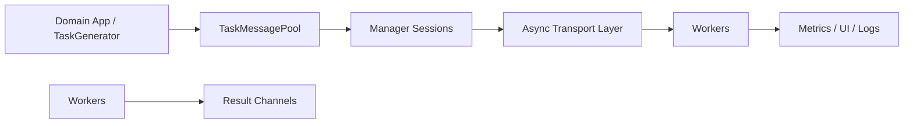

# Task Messenger

Task Messenger is a manager/worker platform for streaming computational tasks from a central coordinator to a dynamic fleet of workers. It links directly against ZeroTier (`libzt`), so all transport flows through ZeroTier sockets and workers reach the manager over a secure virtual network. The platform exposes asynchronous networking, coroutine-friendly session orchestration, and an optional worker UI that lets operators monitor and pause/resume work in real time.

## Subsystems

- **Manager** (`manager/`): Accepts worker connections, runs coroutine sessions, and coordinates task fan-out via `AsyncTransportServer`, `SessionManager`, and mock `TaskGenerator` integrations.
- **Workers** (`worker/`): Connect back to the manager, execute tasks under pluggable runtimes (`BlockingRuntime`/`AsyncRuntime`), track metrics, and optionally expose a terminal UI using FTXUI.
- **Messaging Primitives** (`message/`): Defines `TaskMessage`, `TaskMessagePool`, and helpers that serialize payloads, enforce framing, and provide coroutine-friendly hand-off between producers and sessions.
- **Transport Layer** (`transport/`): Shared networking stack (coroutines, ZeroTier adapters, socket factories) powering both manager and worker runtimes.

## System Flow (Mermaid)

## Documentation
- Generated API/user docs: `meson compile -C builddir-manager docs` then open `builddir-manager/doxygen/html/index.html`.
- High-level modules: see `docs/TaskMessenger.md`, `manager/README.md`, `worker/README.md`, and the README files inside `message/` and `transport/`.
