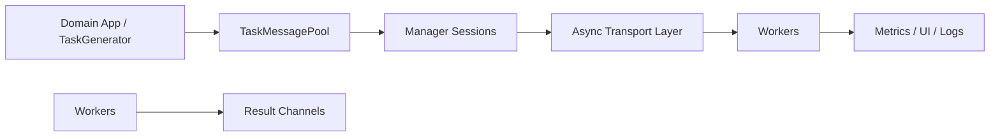

# Task Messenger

Task Messenger is a manager/worker platform for streaming computational tasks from a central coordinator to a dynamic fleet of workers. It links directly against ZeroTier (`libzt`), so all transport flows through ZeroTier sockets and workers reach the manager over a secure virtual network. The platform exposes asynchronous networking, coroutine-friendly session orchestration, and an optional worker UI that lets operators monitor and pause/resume work in real time.

## Subsystems

- **Manager** (`manager/`): Accepts worker connections, runs coroutine sessions, and coordinates task fan-out via `AsyncTransportServer`, `SessionManager`, and mock `TaskGenerator` integrations.
- **Workers** (`worker/`): Connect back to the manager, execute tasks under pluggable runtimes (`BlockingRuntime`/`AsyncRuntime`), track metrics, and optionally expose a terminal UI using FTXUI.
- **Messaging Primitives** (`message/`): Defines `TaskMessage`, `TaskMessagePool`, and helpers that serialize payloads, enforce framing, and provide coroutine-friendly hand-off between producers and sessions.
- **Transport Layer** (`transport/`): Shared networking stack (coroutines, ZeroTier adapters, socket factories) powering both manager and worker runtimes.

## System Flow (Mermaid)


## Project Structure

```
task-messenger/
├── config/                     # Configuration files
│   ├── config-manager.json     # Manager configuration
│   ├── config-worker.json      # Worker configuration
│   └── vn-manager-identity/    # Manager ZeroTier identity files
│       ├── identity.public     # Public identity key
│       └── identity.secret     # Private identity key (secret)
├── manager/                    # Manager component
├── worker/                     # Worker component
├── message/                    # Messaging primitives
├── transport/                  # Transport layer
├── subprojects/                # Dependencies
└── extras/                     # Build and installation scripts
```

## Building

Task Messenger uses Meson as its build system.

### Build All Components (Manager + Worker)

```bash
meson setup builddir --buildtype=release
meson compile -C builddir
```

### Build Only Manager (no FTXUI dependency)

```bash
meson setup builddir-manager -Dbuild_worker=false --buildtype=release
meson compile -C builddir-manager
```

### Build Only Worker

```bash
meson setup builddir-worker -Dbuild_manager=false --buildtype=release
meson compile -C builddir-worker
```

### Build Options

- `-Dbuild_manager=true|false`: Build the manager component (default: true)
- `-Dbuild_worker=true|false`: Build the worker component (default: true)
- `-Ddebug_logging=true|false`: Enable debug logging (default: false)
- `-Dprofiling_unwind=true|false`: Enable profiling-friendly unwind flags (default: false)

## Creating Distribution Packages

Task Messenger provides automated scripts to build distribution packages for deployment:

### Windows Distributions

```powershell
# Build manager distribution (ZIP + self-extracting installer)
.\extras\scripts\build_distribution.ps1 -Component manager

# Build worker distribution (ZIP + self-extracting installer)
.\extras\scripts\build_distribution.ps1 -Component worker

# Build both
.\extras\scripts\build_distribution.ps1 -Component manager
.\extras\scripts\build_distribution.ps1 -Component worker
```

**Output Files** (in `dist/` directory):
- `task-messenger-{component}-v{version}-windows-x64-installer.exe` - Self-extracting installer
- `.sha256` checksum file

The self-extracting installer automatically extracts and runs the installation script, providing a one-click installation experience.

### Linux Distributions

```bash
# Build manager distribution
./extras/scripts/build_distribution.sh --component manager

# Build worker distribution
./extras/scripts/build_distribution.sh --component worker

# Build both
./extras/scripts/build_distribution.sh --component manager
./extras/scripts/build_distribution.sh --component worker
```

**Output Files** (in `dist/` directory):
- `task-messenger-{component}-v{version}-linux-x64.tar.gz` - Compressed tarball
- `.sha256` checksum file

## Configuration

Configuration files are located in the `config/` directory:
- `config-manager.json`: Manager settings including ZeroTier network ID and identity path
- `config-worker.json`: Worker settings
- `vn-manager-identity/`: Manager's ZeroTier identity directory (only identity.public and identity.secret are version-controlled)

## Installation

Task Messenger provides distribution packages for both manager and worker components. Installation scripts follow XDG directory standards:

### Windows Installation Paths

**Binaries** (in `%LOCALAPPDATA%`):
- Manager: `%LOCALAPPDATA%\TaskMessenger\tm-manager\tm-manager.exe`
- Worker: `%LOCALAPPDATA%\TaskMessenger\tm-worker\tm-worker.exe`

**Configuration and Identity** (in `%APPDATA%` - roaming):
- Manager config: `%APPDATA%\TaskMessenger\tm-manager\config-manager.json`
- Manager identity: `%APPDATA%\TaskMessenger\tm-manager\vn-manager-identity\`
- Worker config: `%APPDATA%\TaskMessenger\tm-worker\config-worker.json`

**Installation:**
```powershell
# Extract distribution archive, then run from extracted directory:
.\extras\scripts\install_windows.ps1

# Or specify archive manually:
.\extras\scripts\install_windows.ps1 -Archive tm-manager-v1.0.0-windows-x64.zip
```

**Uninstallation:**
```powershell
# From installation directory:
.\uninstall_windows.ps1

# Or run from extras/scripts:
.\extras\scripts\uninstall_windows.ps1 -Component manager
```

### Linux Installation Paths

**Binaries** (in `~/.local/share`):
- Manager: `~/.local/share/task-messenger/tm-manager/bin/tm-manager`
- Worker: `~/.local/share/task-messenger/tm-worker/bin/tm-worker`

**Configuration and Identity** (in `~/.config` - XDG standard):
- Manager config: `~/.config/task-messenger/tm-manager/config-manager.json`
- Manager identity: `~/.config/task-messenger/tm-manager/vn-manager-identity/`
- Worker config: `~/.config/task-messenger/tm-worker/config-worker.json`

**Installation:**
```bash
# Extract distribution archive, then run from extracted directory:
./extras/scripts/install_linux.sh

# Or specify archive manually:
./extras/scripts/install_linux.sh --archive tm-manager-v1.0.0-linux-x64.tar.gz
```

**Uninstallation:**
```bash
./extras/scripts/uninstall_linux.sh --component manager
```

## Documentation
- Generated API/user docs: `meson compile -C builddir-manager docs` then open `builddir-manager/doxygen/html/index.html`.
- High-level modules: see `docs/TaskMessenger.md`, `manager/README.md`, `worker/README.md`, and the README files inside `message/` and `transport/`.
