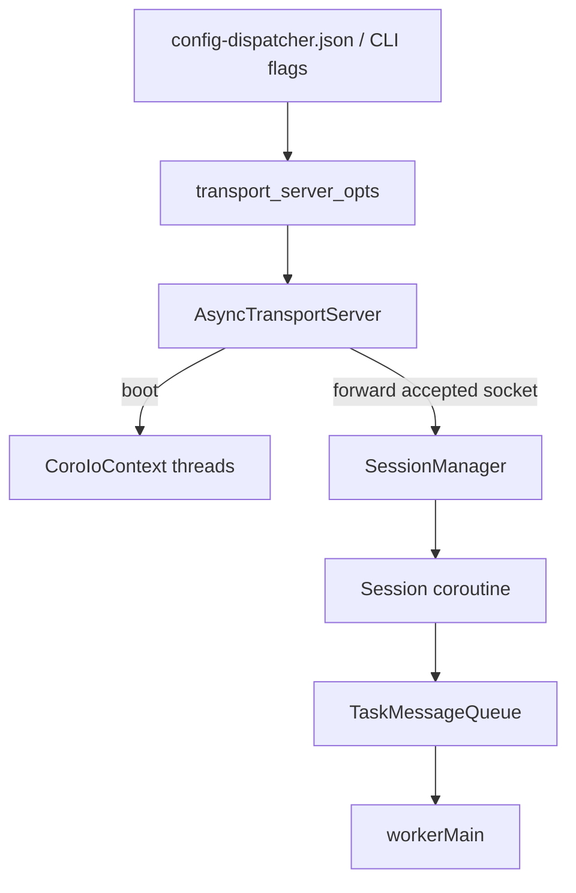
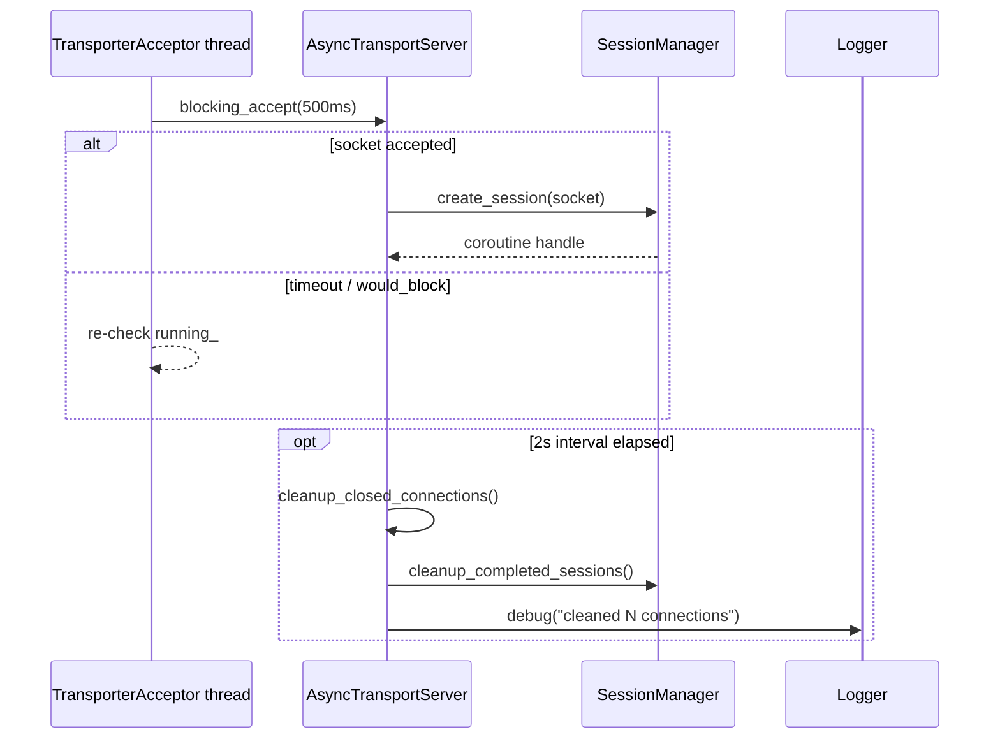

# Dispatcher Transport Module

The `dispatcher/transport/` directory hosts the async acceptor that keeps workers connected to the dispatcher. `AsyncTransportServer` owns the coroutine IO context, the listening socket, and the maintenance thread that cleans up dead sockets. `AsyncTransportOptions` autoloads CLI/JSON settings so the acceptor can boot without bespoke wiring.

## Responsibilities
- Bind a TCP endpoint, spawn the configured number of `transport::CoroIoContext` threads, and feed accepted sockets into `SessionManager`.
- Provide a minimal façade (`enqueue_tasks`, `print_transporter_statistics`) for other dispatcher subsystems so they never touch raw sockets directly.
- Opportunistically clean up closed sockets plus finished sessions to avoid long-lived resource leaks.
- Surface diagnostics (IO-thread counters, active connection count) for operator tooling and CLI stats commands.

All public entry points in this directory participate in the `\ingroup transport_module` Doxygen group so the generated HTML mirrors the message/session documentation.

## Connection Flow (Mermaid)

## Acceptor + Maintenance Loop (Mermaid)

## Related documentation

- Parent component: [dispatcher/README.md](../README.md).
- Shared coroutine networking primitives: [transport/README.md](../../transport/README.md).
- Sessions consuming accepted sockets: [dispatcher/session/README.md](../session/README.md).
