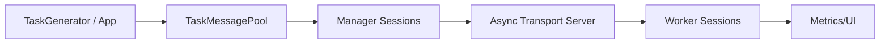

# Task Messenger Overview

\mainpage Task Messenger

Task Messenger is a client/server architecture for dispatching computational tasks from a **Manager** process to a dynamic set of **Workers**. The manager accepts worker connections, feeds them tasks from a shared pool, and performs session lifecycle management. Workers connect back, execute tasks, and report metrics suitable for headless monitoring or UI consumption.

\defgroup task_messenger Task Messenger
\brief High-level overview of the Task Messenger system.

\defgroup task_messenger_manager Manager Subsystem
\ingroup task_messenger
\brief Manager-side components: transport, sessions, and mock generators.

\defgroup task_messenger_worker Worker Subsystem
\ingroup task_messenger
\brief Worker-side runtimes, sessions, and optional UI.

## Subgroups
- \ref task_messenger_manager : Manager subsystem implementation (transport, session management, mock task generator).
- \ref task_messenger_worker : Worker subsystem implementation (runtimes, session orchestration, optional UI).
- Shared utilities like `TaskMessage`/`TaskMessagePool` remain under the top-level Task Messenger group so both subsystems can reference them.

## Flow (Mermaid)

## Doxygen Notes
The Task Messenger main page serves as the Doxygen landing page. Regenerate docs via `meson compile -C builddir-manager docs` to see the manager/worker subgroups side-by-side.
