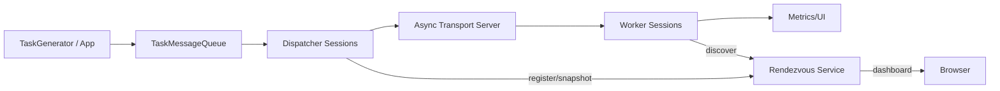

# Task Messenger Overview

\mainpage Task Messenger

Task Messenger is a client/server architecture for dispatching computational tasks from a **Dispatcher** process to a dynamic set of **Workers**. The dispatcher accepts worker connections, feeds them tasks from a shared pool, and performs session lifecycle management. Workers connect back, execute tasks, and report metrics suitable for headless monitoring or UI consumption.

\defgroup task_messenger Task Messenger
\brief High-level overview of the Task Messenger system.

\defgroup task_messenger_dispatcher Dispatcher Subsystem
\ingroup task_messenger
\brief Dispatcher-side components: transport, sessions, and mock generators.

\defgroup task_messenger_worker Worker Subsystem
\ingroup task_messenger
\brief Worker-side runtimes, sessions, and optional UI.

## Subgroups
- \ref task_messenger_dispatcher : Dispatcher subsystem implementation (transport, session management, mock task generator).
- \ref task_messenger_worker : Worker subsystem implementation (runtimes, session orchestration, optional UI).
- Shared utilities like `TaskMessage`/`TaskMessageQueue` remain under the top-level Task Messenger group so both subsystems can reference them.

## Flow (Mermaid)

```mermaid
graph LR
    TG[TaskGenerator / App] --> Pool[TaskMessageQueue]
    Pool --> Dispatcher[Dispatcher Sessions]
    Dispatcher --> Net[Async Transport Server]
    Net --> Workers[Worker Sessions]
    Workers --> Metrics[Metrics/UI]
    Dispatcher -- register/snapshot --> RV[Rendezvous Service]
    Workers -- discover --> RV
    RV -- dashboard --> Browser[Browser]
```

## Rendezvous Service

The optional **tm-rendezvous** service provides endpoint discovery and monitoring
relay so that workers can locate a dispatcher without hard-coded addresses.

- Dispatcher registers its virtual-network endpoint on startup and pushes
  monitoring snapshots periodically.
- Workers query the rendezvous service before their first connection and again
  on reconnect after an I/O error.
- A browser dashboard is served over regular TCP for live monitoring.

### Enabling Rendezvous

Add a `"rendezvous"` section to both dispatcher and worker config files:

```json
{
  "rendezvous": {
    "enabled": true,
    "host": "<rendezvous VN IP>",
    "port": 8088
  }
}
```

Or pass CLI flags: `--rendezvous-enabled true --rendezvous-host <ip> --rendezvous-port 8088`

The rendezvous service itself is configured via `config/config-rendezvous.json`
and launched as `tm-rendezvous -c config/config-rendezvous.json`.

## Doxygen Notes
The Task Messenger main page serves as the Doxygen landing page. Regenerate docs via `meson compile -C builddir-dispatcher docs` to see the dispatcher/worker subgroups side-by-side.
