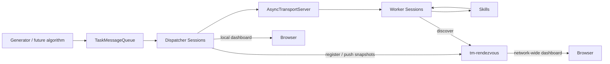

\mainpage Task Messenger

Task Messenger is a small distributed computational network. A
**dispatcher** hosts an algorithm and hands tasks to connected
**workers** over a virtual network; workers execute the tasks using
pluggable **skills** and report back. An optional **rendezvous**
service brokers discovery and serves a network-wide monitoring
dashboard so end users can see live activity in a browser.

This is the Doxygen entry point. Each component below has a Markdown
README at its directory root that documents its public API and
configuration; this page links into them and into the Doxygen group
hierarchy.

\defgroup task_messenger Task Messenger
\brief High-level overview of the Task Messenger system.

\defgroup task_messenger_dispatcher Dispatcher Subsystem
\ingroup task_messenger
\brief Dispatcher-side components: transport, sessions, monitoring, and the generator slot.

\defgroup task_messenger_worker Worker Subsystem
\ingroup task_messenger
\brief Worker-side runtimes, sessions, and optional UI.

## Components

- \ref task_messenger_dispatcher : transport, session management, local
  monitoring HTTP service, and the slot where today's generators
  (the placeholder for future algorithms) plug in. README:
  [dispatcher/README.md](../dispatcher/README.md).
- \ref task_messenger_worker : runtime modes (blocking / async),
  session orchestration, optional FTXUI UI. README:
  [worker/README.md](../worker/README.md).
- **Skills** (\ref skills_module): public API for skill authors —
  `<Skill>.skill.toml` schema plus `<Skill>_impl.hpp` compute body —
  and the registry/codegen backend. README:
  [skills/README.md](../skills/README.md).
- **Transport** (\ref coro_module, \ref socket_backend): coroutine
  primitives and the ZeroTier-backed socket layer shared by the
  dispatcher and the worker. README:
  [transport/README.md](../transport/README.md).
- **Message** (\ref message_module): `TaskMessage`, `TaskMessageQueue`,
  `TaskCompletionSource` — the values that travel between dispatcher
  and worker. README: [message/README.md](../message/README.md).
- **Rendezvous service** (`tm-rendezvous`): the network-wide endpoint
  broker and dashboard server. End users open the rendezvous URL in a
  browser to see network activity. README:
  [services/rendezvous/README.md](../services/rendezvous/README.md).
- **Generators**: today's `tm-generator-interactive` and
  `tm-generator-auto-refill` exercise the dispatcher's algorithm slot
  while the production algorithm has not yet been written. README:
  [generators/README.md](../generators/README.md).
- **Worker farm** (`tm-worker-farm`): a Go-based GUI/CLI that lets end
  users contribute compute by running one or more workers locally or
  on a GitHub Codespace. README:
  [worker-farm/README.md](../worker-farm/README.md).
- **Dashboard**: HTML/JS assets shared by the dispatcher's local
  monitoring endpoint and the rendezvous network-wide endpoint.
  README: [dashboard/README.md](../dashboard/README.md).

## Data flow

```mermaid
graph LR
    Gen[Generator / future algorithm] --> Pool[TaskMessageQueue]
    Pool --> Dispatcher[Dispatcher Sessions]
    Dispatcher --> Net[AsyncTransportServer]
    Net --> Workers[Worker Sessions]
    Workers --> Skills[Skills]
    Skills --> Workers
    Dispatcher -- register / push snapshots --> RV[tm-rendezvous]
    Workers -- discover --> RV
    RV -- network-wide dashboard --> Browser[Browser]
    Dispatcher -- local dashboard --> LocalBrowser[Browser]
```

The dispatcher serves a **local** monitoring dashboard scoped to its
own process. The rendezvous service serves the **network-wide**
dashboard that aggregates the dispatchers that have registered with
it.

## Where to start

- **Install and run as an end user** —
  [docs/INSTALLATION.md](INSTALLATION.md).
- **Operate a dispatcher and bring up a network** —
  [dispatcher/README.md](../dispatcher/README.md) and
  [services/rendezvous/README.md](../services/rendezvous/README.md).
- **Contribute compute from your own machine** —
  [worker-farm/README.md](../worker-farm/README.md).
- **Author a new skill** — [skills/README.md](../skills/README.md).
- **Repository top-level overview** — [README.md](../README.md).

## Doxygen build

Regenerate the Doxygen site via `meson compile -C builddir docs` (or
the configured build directory). The dispatcher and worker subgroups
appear side-by-side in the navigation; the skills, transport, and
message modules each define their own group as documented in their
component READMEs.
