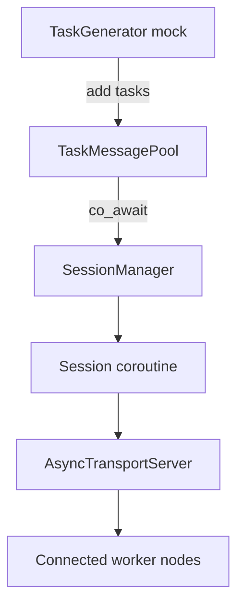

# Manager Module

\ingroup task_messenger_manager

The manager is the server-side half of the **Task Messenger** system. It accepts worker connections, fans tasks out through coroutine-aware sessions, and exposes mock producers that demonstrate how real computational pipelines can stream work into the platform.

## Submodules
- `transport/`: asynchronous TCP acceptor (`AsyncTransportServer`) that exposes a minimal façade for enqueueing tasks and inspecting IO statistics. Part of `task_messenger_manager` Doxygen subgroup.
- `session/`: `SessionManager` and coroutine session runtimes that translate task payloads into wire-level traffic and track per-worker metrics. Also nested under `task_messenger_manager`.
- `TaskGenerator.*`: mock workload producer used by demos/tests to showcase Task Messenger integration points.

## Lifecycle Overview (Mermaid)

## Authoring Notes
- Mark public entry points with the `task_messenger_manager` Doxygen subgroup.
- When adding new subsystems under `manager/`, update this overview and ensure documentation mirrors the message/session modules for consistency.
- Real applications should replace `TaskGenerator` with domain-specific producers that stream tasks into `TaskMessagePool`.
