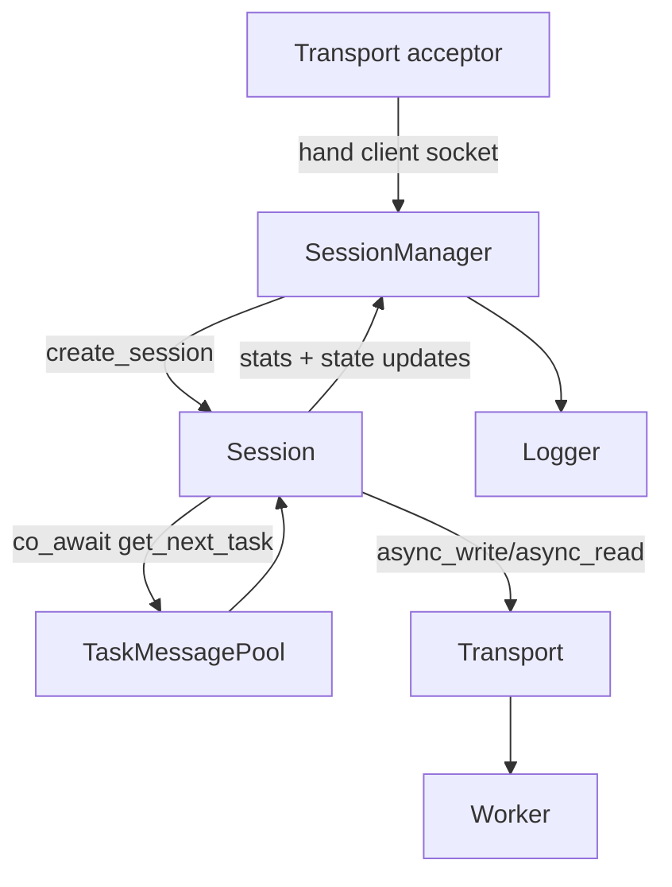
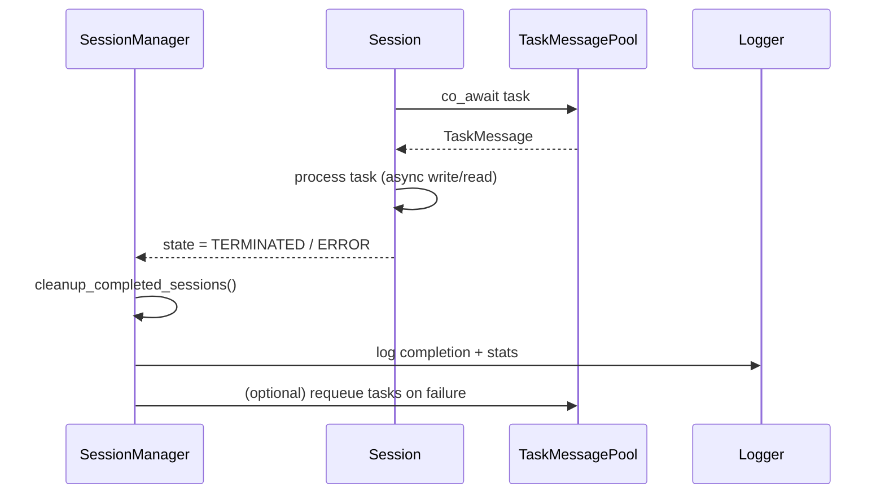

# Session Management Module

The `manager/session/` module orchestrates every manager<->worker conversation. Each accepted socket gets a `Session` coroutine that pulls work from the shared `TaskMessagePool`, pushes it across the transport layer, and records latency metrics that feed operator statistics.

## Responsibilities
- Translate `TaskMessagePool` work into serialized wire traffic via `transport::CoroSocketAdapter`.
- Track per-session lifecycle state, throughput, and round-trip timing.
- Coordinate task fan-out and cleanup through `SessionManager`, which owns the shared pool and collection of active sessions.

All public APIs are tagged with `\ingroup session_module` so they appear under the *Session Management Module* section in the generated Doxygen docs.

## Lifecycle Overview (Mermaid)

## Cleanup Flow (Mermaid)

## Authoring Tips
- `Session` encapsulates the coroutine (`Task<void>`) that owns each client lifecycle. Keep shared data (`TaskMessagePool`, logger) as `std::shared_ptr` to extend lifespan beyond the accept thread.
- `SessionManager` is the public façade. Extend it with diagnostic helpers or throttling logic instead of letting outside callers touch internal session containers directly.
- when adding new state transitions, document them via `SessionState` comments and, if they affect cleanup, update the diagram and `cleanup_completed_sessions()` docs.
- Run `meson compile -C builddir-manager docs` to regenerate HTML docs; Doxygen now scans this directory thanks to the `session_module` annotations.
