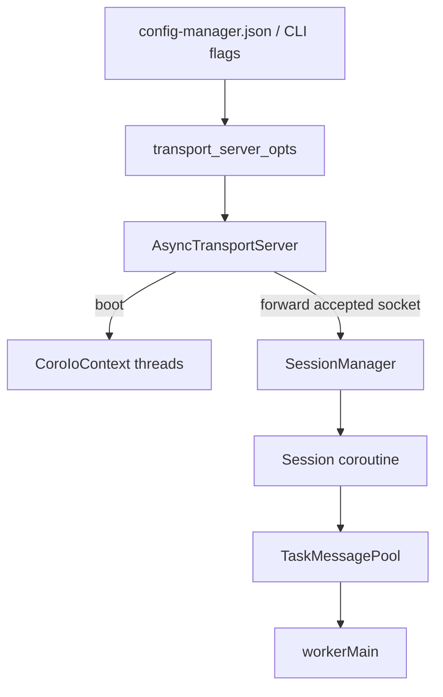
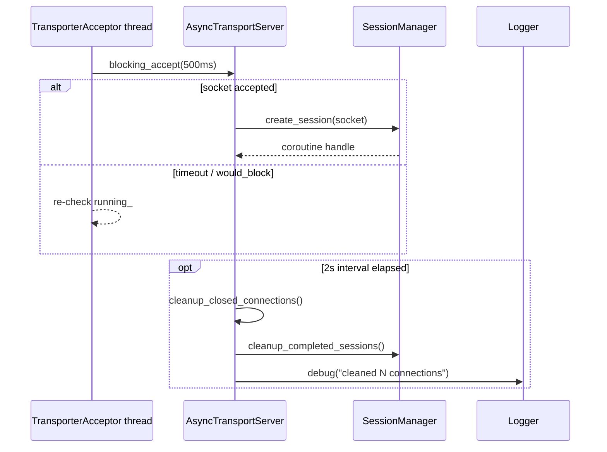

# Manager Transport Module

The `manager/transport/` directory hosts the async acceptor that keeps workers connected to the manager. `AsyncTransportServer` owns the coroutine IO context, the listening socket, and the maintenance thread that cleans up dead sockets. `AsyncTransportOptions` autoloads CLI/JSON settings so the acceptor can boot without bespoke wiring from `managerMain.cpp`.

## Responsibilities
- Bind a TCP endpoint, spawn the configured number of `transport::CoroIoContext` threads, and feed accepted sockets into `SessionManager`.
- Provide a minimal façade (`enqueue_tasks`, `print_transporter_statistics`) for other manager subsystems so they never touch raw sockets directly.
- Opportunistically clean up closed sockets plus finished sessions to avoid long-lived resource leaks.
- Surface diagnostics (IO-thread counters, active connection count) for operator tooling and CLI stats commands.

All public entry points in this directory participate in the `\ingroup transport_module` Doxygen group so the generated HTML mirrors the message/session documentation.

## Connection Flow (Mermaid)

## Acceptor + Maintenance Loop (Mermaid)

## Authoring Notes
- Prefer succinct `/** ... */` comments with `\ingroup transport_module` annotations when exposing new public APIs so Doxygen keeps this module grouped.
- Keep connection hygiene in `cleanup_closed_connections()` even for future transport implementations; the maintenance cadence is deliberately shared with session cleanup.
- When expanding CLI or JSON options, update `AsyncTransportOptions.cpp` and mirror defaults in `config-manager.json` to prevent surprising mismatches.
- Rebuild docs with `meson compile -C builddir-manager docs` to see the updated Transport module next to Session and Message sections.
