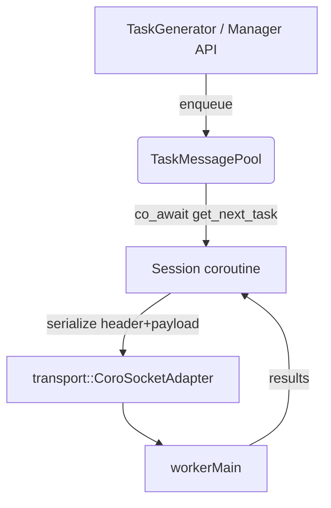
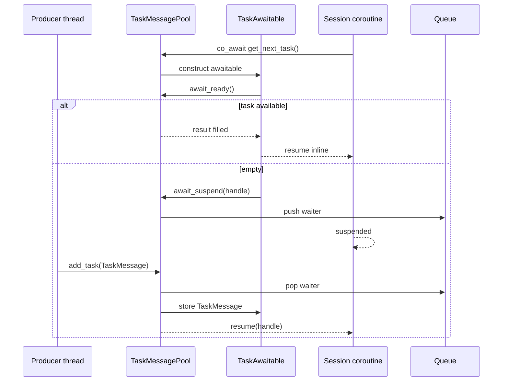

# Task Message Module

Utilities in `message/` format task payloads and distribute them to manager sessions without blocking. 

## Responsibilities
- Serialize manager<->worker traffic into a contiguous `{TaskHeader + payload}` buffer (`TaskMessage`).
- Provide a coroutine-friendly queue (`TaskMessagePool`) so acceptor sessions can `co_await` new work.
- Track timing metadata to help latency tooling (`TaskMessage::get_age`).

## Key Types
- `TaskHeader`: fixed-width framing that travels on the wire ahead of every payload.
- `TaskMessage`: owns the contiguous storage, validates payload sizes, and exposes header/payload views.
- `TaskMessagePool` + `TaskAwaitable`: awaitable bridge between producers (task generators, RPC handlers) and consumers (session coroutines).

> All public entry points are tagged with `\ingroup message_module` so Doxygen groups them under *Task Message Module*.

## Data Flow (Mermaid)

## Awaitable Lifecycle (Mermaid)

## Authoring Notes
- Prefer succinct `/** \brief ... */` comments over `//` for public APIs to keep Doxygen output readable.
- When adding new pool helpers, update the diagrams above if control flow changes.
- Build docs alongside existing modules: `meson compile -C builddir-manager docs`. The generated HTML now surfaces the `message_module` group next to transport and worker sections.
