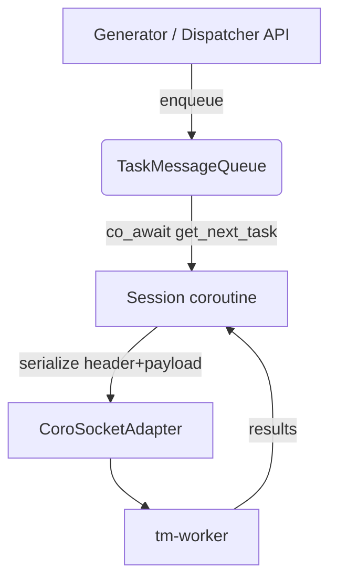
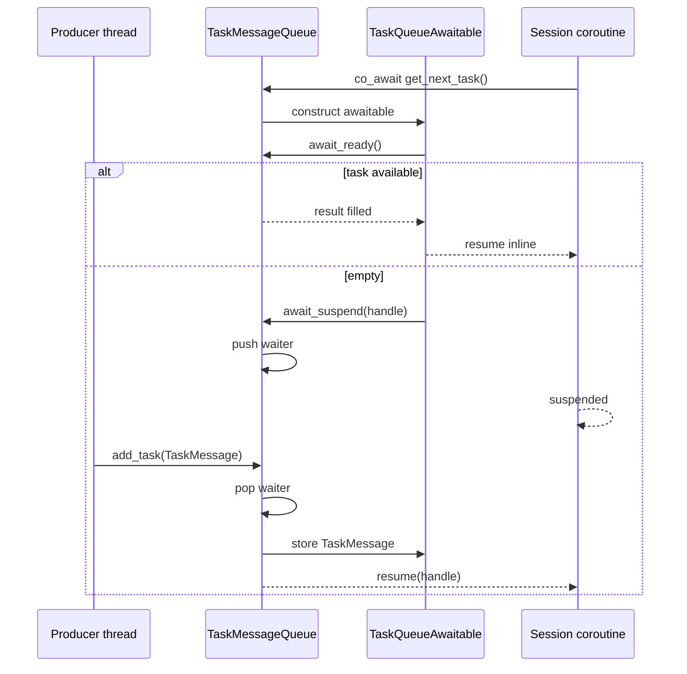

# Task message

\defgroup message_module Task message

Framing and queuing primitives shared by generators, dispatchers, and
workers.

## Responsibilities

- Frame dispatcher↔worker traffic as a contiguous
  `{TaskHeader + payload}` buffer (`TaskMessage`).
- Provide a coroutine-friendly queue (`TaskMessageQueue`) so session
  coroutines can `co_await` new work.
- Track timing metadata for latency tooling
  (`TaskMessage::get_age`).

## Key types

| Type | Role |
| --- | --- |
| `TaskHeader` | Fixed-width framing on the wire. |
| `TaskMessage` | Owns contiguous storage; validates payload sizes; exposes header/payload views. |
| `TaskMessageQueue` + `TaskQueueAwaitable` | Awaitable bridge between producers (generators, RPC handlers) and consumers (session coroutines). |

All public entry points are tagged `\ingroup message_module`.

## Data flow

```mermaid
graph TD
    TG[Generator / Dispatcher API] -->|enqueue| Queue(TaskMessageQueue)
    Queue -->|co_await get_next_task| Session[Session coroutine]
    Session -->|serialize header+payload| Transport[CoroSocketAdapter]
    Transport --> Worker[tm-worker]
    Worker -->|results| Session
```

## Awaitable lifecycle

```mermaid
sequenceDiagram
    participant Prod as Producer thread
    participant Q as TaskMessageQueue
    participant Aw as TaskQueueAwaitable
    participant S as Session coroutine

    S->>Q: co_await get_next_task()
    Q->>Aw: construct awaitable
    Aw->>Q: await_ready()
    alt task available
        Q-->>Aw: result filled
        Aw-->>S: resume inline
    else empty
        Aw->>Q: await_suspend(handle)
        Q->>Q: push waiter
        S-->>S: suspended
        Prod->>Q: add_task(TaskMessage)
        Q->>Q: pop waiter
        Q->>Aw: store TaskMessage
        Q-->>S: resume(handle)
    end
```

## Related documentation

- Networking: [transport/README.md](../transport/README.md).
- Dispatcher session that consumes the queue: [dispatcher/session/README.md](../dispatcher/session/README.md).
