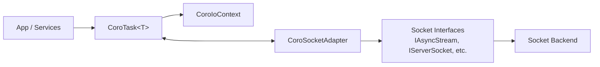

# Transport Layer

Coroutine-aware I/O infrastructure and role-based socket interfaces. This layer contains:
- `coro/`: a cooperative event loop (`CoroIoContext`), coroutine `Task` types, and a `CoroSocketAdapter` that integrates non-blocking I/O into coroutines.
- `socket/`: small interfaces for non-blocking/blocking sockets and concrete backends (e.g., ZeroTier/libzt) selected via a factory.

## Architecture



- Coroutines register non-blocking operations with `CoroIoContext`, which polls pending operations and resumes awaiters on completion.
- The `CoroSocketAdapter` provides awaitables (`co_await`) over the role-based socket interfaces.
- Concrete backends live under `socket/<backend>/` and are selected via `SocketFactory` based on configuration.

## Submodules

- `coro/`: design, lifecycle, metrics, and sequence/topology diagrams.
  - See `coro/README.md` for details and examples.
- `socket/`: role interfaces, factory/options, and backends.
  - See `socket/README.md` and `socket/zerotier/README.md`.

## Typical Usage

- Use `SocketFactory` to obtain role objects (`IServerSocket`, `IAsyncStream`, etc.).
- Wrap those with `CoroSocketAdapter` to get coroutine-friendly awaitables for connect, read, write, and accept.
- Keep exactly one in-flight operation per adapter instance to satisfy the event loop’s pending-op invariant.

## Doxygen

Documentation is generated via Meson’s optional `docs` target and includes both submodules.
- Groups: `\defgroup coro_module` (subgroups for task, context, adapter, stats) and `\defgroup socket_backend` for the socket layer and backends.

Regenerate docs:
```powershell
meson compile -C builddir-manager docs
```
Output: `builddir-manager/doxygen/`.

## Extensibility

- Add new backends under `socket/<backend>/` implementing the role interfaces; register them in `SocketTypeOptions` and `SocketFactory`.
- Introduce new awaitables in `CoroSocketAdapter` to cover additional operations while preserving the single in-flight op invariant.
- Keep Doxygen `\file` headers and `\ingroup` tags consistent for navigable API docs.
