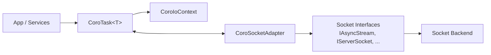

# Transport

\defgroup coro_module Coroutine I/O
\defgroup socket_backend Sockets

Coroutine-aware networking shared by every Task Messenger component.

## Submodules

| Path | Scope |
| --- | --- |
| [coro/](coro/README.md) | `CoroIoContext`, `CoroTask`, and `CoroSocketAdapter`: the cooperative event loop and coroutine glue. |
| [socket/](socket/README.md) | Role-based socket interfaces (`IAsyncStream`, `IServerSocket`, etc.) and `SocketFactory`. |
| [socket/zerotier/](socket/zerotier/README.md) | The ZeroTier (`libzt`) socket backend. |

## Architecture

```mermaid
flowchart LR
  App[App / Services]
  Task[CoroTask&lt;T&gt;]
  Ctx[CoroIoContext]
  CSA[CoroSocketAdapter]
  IF[Socket Interfaces<br/>IAsyncStream, IServerSocket, ...]
  BE[Socket Backend]

  App --> Task --> Ctx
  Task <---> CSA
  CSA --> IF --> BE
```

Coroutines register non-blocking operations with `CoroIoContext`,
which polls them and resumes awaiters on completion.
`CoroSocketAdapter` exposes role-based socket interfaces as
awaitables. Concrete backends live under `socket/<backend>/` and are
selected via `SocketFactory`.

## Typical usage

- Use `SocketFactory` to obtain a role object (`IServerSocket`,
  `IAsyncStream`, ...).
- Wrap it with `CoroSocketAdapter` for `co_await`-friendly
  connect/read/write/accept.
- Keep one in-flight operation per adapter instance to satisfy the
  event loop's pending-op invariant.

## Adding a backend

Implement the role interfaces under `socket/<backend>/`, register
the backend in `SocketTypeOptions` and `SocketFactory`, and tag
public entry points with `\ingroup socket_backend` so Doxygen
groups them.

## Doxygen

Build with `meson compile -C builddir docs`. Output:
`builddir/doxygen/`.
