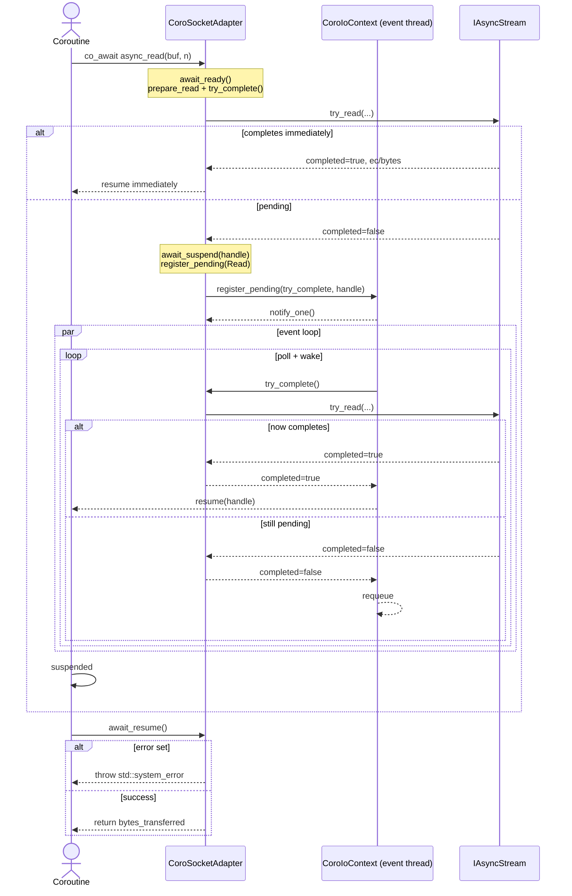

# Coroutine I/O Context and Socket Adapter

A lightweight adapter for the C++20 coroutine model. It provides awaitable read/write operations backed by non-blocking `try_*` calls in a pluggable `IAsyncStream` backend, resuming coroutines on event-loop threads and gathering metrics with minimal allocation overhead.

## Components
- `CoroTask.hpp`: Minimal `Task<T>` and `Task<void>` coroutine task types with `initial_suspend = suspend_never`, `final_suspend = suspend_always`, and owned handle lifetime.
- `coroIoContext.hpp/.cpp`: Event loop that polls pending operations via non-blocking `try_complete()` functors and resumes coroutines when ready. Includes per-thread counters and per-category completion attempt histograms.
- `CoroSocketAdapter.hpp/.cpp`: Awaitable read/write operations over an `IAsyncStream` backend (e.g., ZeroTier, BSD non-blocking, UDP), scheduled by `CoroIoContext`.

## Quickstart

- Create or use the default loop. Continuations resume on loop threads.
- Use `CoroSocketAdapter` factories to get a client or server stream.

```cpp
#include "transport/coro/CoroSocketAdapter.hpp"
#include "transport/coro/coroIoContext.hpp"
#include "transport/coro/CoroTask.hpp"

using transport::CoroSocketAdapter;
using transport::default_loop;

Task<void> echo_client(std::shared_ptr<Logger> log) {
    auto ctx = default_loop();            // or make_shared<CoroIoContext>(); ctx->start(2);
    auto sock = CoroSocketAdapter::create_client(log, ctx);

    sock->connect("127.0.0.1", 9000);    // non-blocking connect with bounded sleeps

    const char msg[] = "ping";
    co_await sock->async_write(msg, sizeof(msg));

    // Read a fixed-size protocol header separately for metrics (ReadHeader category)
    struct ResponseHeader { uint32_t body_size; uint32_t reserved; } hdr{}; // illustrative
    co_await sock->async_read_header(&hdr, sizeof(hdr));

    // Then read body/payload using generic read (Read category)
    std::vector<char> buf(hdr.body_size);
    size_t n = co_await sock->async_read(buf.data(), buf.size());
    (void)n;
    co_return;
}
```

Server accept sketch (dedicated acceptor thread + blocking accept):

```cpp
void accept_loop(std::shared_ptr<CoroSocketAdapter> server, std::shared_ptr<Logger> log) {
    std::error_code ec;
    for (;;) {
        auto client = server->blocking_accept(ec, std::chrono::milliseconds(250));
        if (!client) { if (ec) {/* handle error */} continue; }
        // Dispatch a coroutine per client using the same default loop
        // spawn(Task<void>{ /* co_await client->async_read(...); */ });
    }
}
```

## Threading Model
- `CoroIoContext::start(n)` creates `n` event threads; each runs the same loop.
- Pending ops are registered with a non-blocking predicate via `register_pending`.
- One waiting thread is notified (`notify_one()`), with a 10ms poll fallback to avoid lost wakeups and ensure shutdown.
- Continuations resume on an event-loop thread (not the caller thread).

## Coroutine Lifecycle
- `Task<T>` starts immediately (`suspend_never`) and suspends at final suspend (`suspend_always`); the `Task` destructor destroys the coroutine frame.
- Awaitables attempt completion in `await_ready()`; otherwise they store the coroutine handle and register with `CoroIoContext`. `await_resume()` returns bytes transferred or throws on error.

## Errors and Logging
- `CoroSocketAdapter` awaitables throw `std::system_error` from `await_resume()` when backend `try_*` sets an error.
- `connect()` retries non-blocking connect and throws `std::system_error` on failure.
- Optional `Logger` (if set) receives info/error messages. `CoroIoContext::log_detailed_statistics()` prints metrics.
- Note: `Task<T>::unhandled_exception()` currently swallows exceptions; exceptions from inside coroutine bodies are not propagated via `get_result()`.

## Metrics
- Total operations processed and per-thread operation counters (coroutine resumes).
- Completion attempt histograms per category (Generic, Read, ReadHeader, Write, Timer): bucket `k` counts operations that completed after exactly `k` failed `try_complete()` attempts; the last bucket aggregates `>= max`.
- Use `async_read_header()` for fixed-size framing (task/request/response headers) to attribute attempts to `ReadHeader`; use `async_read()` for variable-size payloads/body data. This separation enables future header-specific validation or timeouts and keeps body latency statistics distinct.
- Aggregates: min/avg/max failures-before-success. Reset via `reset_statistics()`.

## Design Constraints
- One in-flight operation per `CoroSocketAdapter` instance (buffers and state are reused per op).
- `try_complete()` must be non-blocking; the loop is not epoll/IOCP-based.
- 10ms poll fallback balances idle CPU with latency; adjust in code if needed.

## FAQ
- Which thread resumes my coroutine? An event-loop thread.
- Can I run overlapping reads/writes on a single adapter? Not supported; serialize or use separate adapters.
- How do I keep the loop alive while preparing work? Use `CoroIoContext::WorkGuard`.
- Can I generate API docs? Yes—comments follow Doxygen style. You can add a `Doxyfile` and run `doxygen` to generate HTML.

## Scheduling Flow (Mermaid)


## Event Loop Topology (Mermaid)


