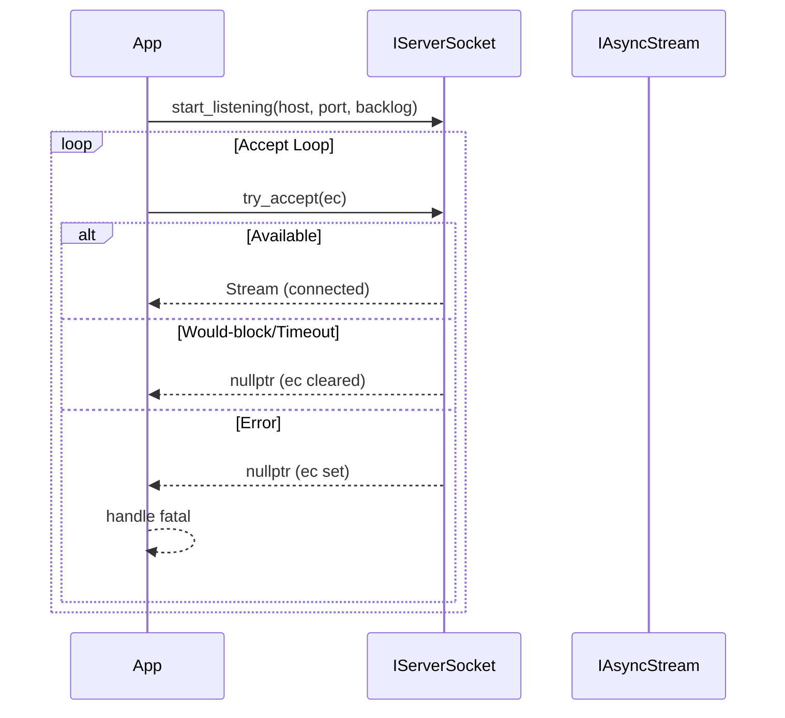

# Socket Layer

Role-based socket interfaces and implementations for both non-blocking and blocking I/O. This layer decouples higher-level logic from concrete backends (e.g., ZeroTier/libzt) via small, composable interfaces and a factory.

## Components

- `ISocketLifecycle`: Common lifecycle primitives (`close()`, `is_open()`, endpoint accessors).
- `IAsyncStream`: Non-blocking read/write stream API (`try_read`, `try_write`).
- `IBlockingStream`: Blocking read/write/connect counterparts.
- `IClientSocket`: Client connect interface with blocking semantics.
- `IServerSocket`: Server role providing `start_listening` (non-throwing, bool-returning), `try_accept`, and a timed `blocking_accept` fallback.
- `SocketFactory`: Resolves a concrete backend at runtime and constructs role objects.
- `SocketTypeOptions`: Registers and retrieves backend type options (CLI/JSON integration).
- `message/TaskMessage.hpp`: Lightweight framing structures (via `TaskHeader`) used by higher layers when exchanging task payloads.
- `zerotier/`: Concrete backend using ZeroTier (libzt), implementing stream + server roles.

## Design Principles

- **Role separation**: Small interfaces for specific responsibilities keep implementations simple and testable.
- **Non-blocking semantics**: `try_*` methods return a boolean completion status (or `nullptr` for accept). They clear `std::error_code` on pending states and set it only on non-transient failures.
- **Blocking semantics**: Blocking methods report completion through `std::error_code` and never throw for normal I/O errors.
- **Timed accept**: `IServerSocket::blocking_accept` provides a timed, responsive accept. The interface supplies a portable fallback loop using short sleeps over `try_accept`; backends may override with native timed accept (e.g., the ZeroTier implementation).
- **Backend encapsulation**: Factories and options hide library-specific headers and flags from higher layers.

## Typical Flows

### Non-Blocking Server Loop
```cpp
#include "SocketFactory.hpp"
#include "IServerSocket.hpp"
#include "IAsyncStream.hpp"
#include <system_error>

std::error_code ec;
auto server = SocketFactory::create_server(/*type*/ "zerotier");
if (!server->start_listening("0.0.0.0", 5555, /*backlog*/ 128)) {
  // Handle startup failure (already logged by backend)
  return;
}

for (;;) {
    auto client = server->try_accept(ec);
    if (client) {
        // Handle connected client (non-blocking I/O via IAsyncStream)
    } else if (ec) {
        // Non-transient failure; log and break
        break;
    }
    // Do other work / yield to coroutine loop
}
```

### Timed Blocking Accept
```cpp
#include "SocketFactory.hpp"
#include "IServerSocket.hpp"
#include <chrono>
#include <system_error>

std::error_code ec;
auto server = SocketFactory::create_server("zerotier");
if (!server->start_listening("0.0.0.0", 5555, 128)) {
  // Handle startup failure before entering loop
  return;
}

while (!shutdown_requested()) {
    auto client = server->blocking_accept(ec, std::chrono::milliseconds(500));
    if (client) {
        // Process client immediately
    } else if (ec) {
        // Fatal error
        break;
    } else {
        // Timeout or transient; loop and re-check shutdown flag
    }
}
```

### Non-Blocking Client Connect + I/O
```cpp
#include "SocketFactory.hpp"
#include "IAsyncStream.hpp"
#include <system_error>

std::error_code ec;
auto conn = SocketFactory::create_async_client("zerotier");
conn->connect("10.0.0.2", 8080, ec);
if (ec) { /* handle failure */ }

char buf[1024]; size_t n = 0;
auto stream = std::static_pointer_cast<IAsyncStream>(conn);
if (stream->try_read(buf, sizeof(buf), n, ec)) {
    if (!ec) { /* consumed n bytes */ }
}
```

## Options and Factory

`SocketTypeOptions` integrates backend selection with your app’s configuration. Typical providers:

- CLI: `--socket-type zerotier`
- JSON: `{ "socket": { "type": "zerotier" } }`

`SocketFactory` inspects the configured type and returns appropriate implementations for server/client/stream roles. See the ZeroTier backend for a concrete example.

## Frames

`message/TaskMessage.hpp` exposes the `TaskHeader` POD used for both request and response framing. It remains transport-agnostic and can be serialized over any `IAsyncStream`/`IBlockingStream` implementation.

## Mermaid: Server Accept Overview



## Backend: ZeroTier

The `zerotier/` directory provides a libzt-based implementation:
- `ZeroTierSocket`: `IAsyncStream` + `IBlockingStream` + server accept.
- `ZeroTierNodeService`: Starts/stops the node and manages network joins via RAII leases.
- `ZeroTierErrnoCompat`: Normalizes libzt/lwIP errno values and provides helpers.

See `zerotier/README.md` for detailed design, configuration, and examples.

## Documentation

This directory is included in the Doxygen target. Many headers use `\ingroup socket_backend` for grouping. Regenerate docs with:

```powershell
meson compile -C builddir-manager docs
```

## Extending the Socket Layer

1. Define a new backend directory (e.g., `transport/socket/<backend>`).
2. Implement the relevant roles (`IAsyncStream`, `IBlockingStream`, `IServerSocket`, etc.).
3. Register the backend in `SocketTypeOptions` and plug it into `SocketFactory`.
4. Add Doxygen `\file` headers and tag the new code with the socket group.
