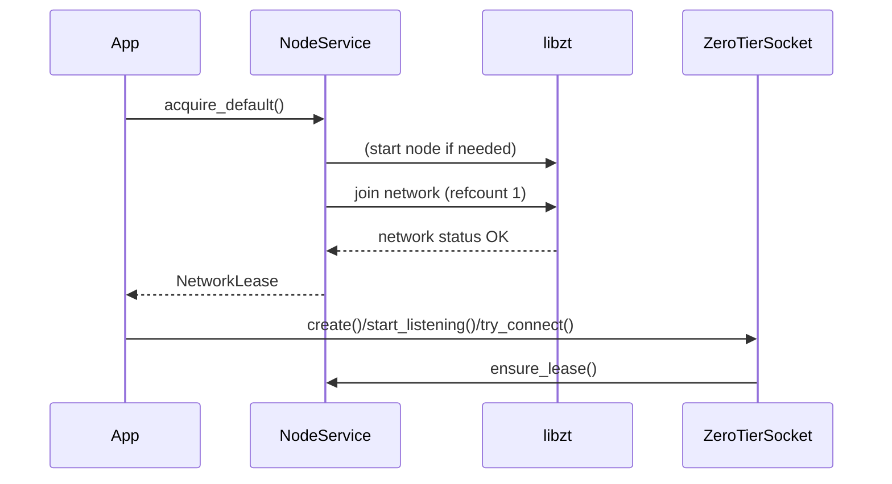

# ZeroTier Socket Backend

This directory implements a ZeroTier (libzt) backed transport layer for the generic socket interfaces (`IAsyncStream`, `IBlockingStream`, server accept roles). It provides both **non-blocking** and **blocking** operations while coordinating a shared process-wide ZeroTier node lifecycle.

## Components

- **`ZeroTierNodeService`**: Singleton that starts/stops the libzt node, tracks joined networks with reference counts, and exposes address lookup helpers. Networks are joined via RAII `NetworkLease` objects.
- **`NetworkLease`**: Move-only token. Acquiring one joins a network on first use; destroying the last lease leaves the network.
- **`ZeroTierSocket`**: Implements `IAsyncStream` + `IBlockingStream` over a libzt TCP stream (`ZTS_AF_INET`, `ZTS_SOCK_STREAM`). Supports:
  - Non-blocking connect, read, write, accept.
  - Blocking connect/read/write.
  - Timed `blocking_accept`—leverages libzt/lwIP timeout rather than a manual spin loop.
- **`ZeroTierErrnoCompat`**: Normalizes libzt/embedded lwIP errno values to host errno space and provides helpers for would-block detection and stringification.

## Configuration Options

Options are registered automatically (`ZeroTierNodeService::register_options`) and can be provided via CLI or JSON:

| Purpose | CLI | JSON Path |
|---------|-----|-----------|
| Identity storage directory | `--zerotier-identity PATH` | `{ "zerotier": { "identity_path": "..." } }` |
| Default network (hex ID)   | `--zerotier-default-network HEX` | `{ "zerotier": { "default_network": "..." } }` |

If no identity path is configured, libzt may create an ephemeral identity (not persisted). The default network falls back to `ZeroTierNodeService::DEFAULT_ZEROTIER_NETWORK` if none is supplied.

## Lifecycle Overview



Destroying sockets releases their internal lease only if it was acquired implicitly; explicit application-held leases remain until they go out of scope.

## Blocking Accept Rationale

`ZeroTierSocket::blocking_accept` chooses a **receive timeout**–based blocking accept rather than a custom loop using `try_accept + sleep` to avoid hand-tuning latency vs CPU trade-offs. A moderate timeout (default `500ms`) provides:

- Negligible idle CPU usage.
- Periodic wake-ups to observe shutdown/cancellation flags.
- Simplicity: leaves efficient waiting to the TCP/IP stack.

Transient conditions (`EAGAIN`, `EWOULDBLOCK`, `ETIMEDOUT`, `ECONNABORTED`, `ESHUTDOWN`, `EBADF`) return `nullptr` with a cleared error, allowing the caller to poll its own control state.

## Usage Examples

### Server Setup (Non-Blocking Loop)
```cpp
std::error_code ec;
auto server = ZeroTierSocket::create();
if (!server->start_listening("0.0.0.0", 5555)) {
    // Startup failure was logged by the socket; surface locally if needed
    return;
}
for (;;) {
    auto client = server->try_accept(ec);
    if (client) {
        // Handle new connection
    } else if (ec) {
        // Non-transient failure
        break;
    }
    // Do other work / coroutine scheduling
}
```

### Timed Blocking Accept
```cpp
std::error_code ec;
auto server = ZeroTierSocket::create();
if (!server->start_listening("0.0.0.0", 5555)) {
    return;
}
while (!shutdown_requested()) {
    auto client = server->blocking_accept(ec, std::chrono::milliseconds(500));
    if (client) {
        // Process client immediately
    } else if (ec) {
        // Fatal accept error -> exit
        break;
    } else {
        // Timeout or transient -> loop and recheck shutdown flag
    }
}
```

### Non-Blocking Connect
```cpp
std::error_code ec;
auto sock = ZeroTierSocket::create();
if (!sock->try_connect("10.147.17.2", 8080, ec)) {
    // Connection in progress; poll until completion
    while (!sock->check_connect_complete(ec)) {
        // Integrate with event loop / coroutine yields
    }
}
if (ec) { /* handle failure */ }
```

### Blocking I/O
```cpp
std::error_code ec;
auto sock = ZeroTierSocket::create_blocking();
sock->connect("10.147.17.2", 8080, ec);
if (!ec) {
    char buf[1024]; size_t n = 0;
    sock->read(buf, sizeof(buf), n, ec);
}
```

## Error Handling

- Libzt-specific errno codes are normalized via `ZeroTierErrnoCompat::normalize_errno`.
- Would-block detection uses `ZeroTierErrnoCompat::is_would_block_errno`.
- Public APIs report completion via `std::error_code` (non-blocking methods clear error on pending states).

## Grouping / Documentation

All files are tagged with `\ingroup socket_backend`. If you want a dedicated ZeroTier subgroup:
```cpp
/** \defgroup socket_zerotier ZeroTier Socket Backend
 *  \ingroup socket_backend
 *  \brief libzt-driven implementation of socket interfaces.
 */
```
Add the above to a common header (e.g. `ZeroTierSocket.hpp`) and tag related classes with `\ingroup socket_zerotier` for a separate index page.

## Design Notes

- **Lease Acquisition**: Sockets acquire a default network lease lazily (`ensure_lease()`) to avoid premature node startup.
- **Mode Selection**: `SocketMode::NonBlocking` vs `SocketMode::Blocking` set once at construction; non-blocking operations toggle fd flags appropriately.
- **Endpoint Strings**: Cached via `update_endpoints()`; reading endpoints performs libzt queries.
- **Timeout Granularity**: Actual blocking behavior depends on libzt / lwIP implementation of receive timeouts; large timeouts reduce wake frequency, small ones increase responsiveness.

## Extensibility

To add features:
- Additional metrics: Wrap connect/accept with counters and export via a stats interface.
- Alternate networks: Provide APIs to acquire specific hex network IDs distinct from default.
- TLS overlay: Wrap an accepted or connected ZeroTier fd with a TLS stream class implementing the same interfaces.

## Build / Docs

Regenerate Doxygen documentation:
```powershell
meson compile -C builddir-manager docs
```
Output resides under `builddir-manager/doxygen/`.

---
For questions on extending the backend or integrating new protocols over ZeroTier, encapsulate logic in separate adapters while reusing `ZeroTierNodeService` for node lifecycle.
