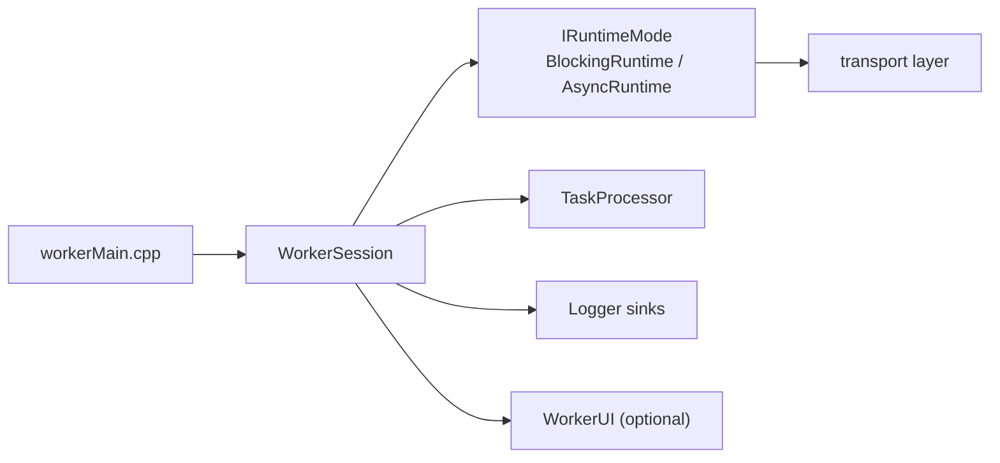

# Worker Module

\ingroup task_messenger_worker

Worker process that connects to the manager, executes queued tasks, and reports metrics suitable for UI visualization. The worker is composed of small submodules that collectively form the `task_messenger_worker` subgroup:

- `runtime/`: pluggable execution engines (`BlockingRuntime`, `AsyncRuntime`) implementing socket ownership and I/O loops, utilizing either a blocking or coroutine-enabled asynchronous methods. (\ingroup task_messenger_worker)
- `session/`: `WorkerSession` orchestrates lifecycle, configuration, logging, and metrics aggregation. (\ingroup task_messenger_worker)
- `ui/`: optional FTXUI-powered terminal dashboard plus the `IWorkerService` contract. (\ingroup task_messenger_worker)
- `processor/`: task handler shim (`TaskProcessor`) invoked from any runtime mode. (\ingroup task_messenger_worker)

## Architecture Overview



- `workerMain.cpp` parses configuration, instantiates a `WorkerSession`, and optionally launches the UI.
- The session owns a concrete `IRuntimeMode`, selected via CLI/JSON (`blocking` or `async`).
- Both runtimes rely on transport-layer factories to obtain sockets (ZeroTier by default).
- Metrics (tasks, bytes sent/received) are consolidated in the session so they remain consistent regardless of the active runtime.
- When FTXUI is present, `WorkerUI` attaches through `IWorkerService` and renders the live state.

## Modes & Byte Counters

Runtime mode is controlled via `--mode blocking|async` (or JSON config). Every mode emits the same counters:

- `tasks_completed`: incremented per work item.
- `bytes_sent` / `bytes_received`: maintained by runtimes, formatted by `WorkerSession` for UI/CLI consumers.

The UI and log sinks receive string-formatted values (e.g., `1.5MB`). The raw `uint64_t` counters remain available via the runtime interface for other integrations.

## Configuration Summary

| Option | Source | Description |
| --- | --- | --- |
| `--mode` / `worker.mode` | CLI / JSON | Selects `BlockingRuntime` or `AsyncRuntime`. |
| `--ui` / `worker.ui` | CLI / JSON | Enables the FTXUI dashboard when available. Falling back to headless if FTXUI is missing. |
| `--manager-host` / `worker.manager_host` | CLI / JSON | Manager host. |
| `--manager-port` / `worker.manager_port` | CLI / JSON | Manager port. |
| `--identity-dir` / `worker.identity_dir` | CLI / JSON | Override ZeroTier identity directory. |

## UI & Demo

The UI is optional and compiled only when FTXUI is detected. To explore it without a manager connection, build and run the demo harness:

```powershell
meson compile -C builddir-worker worker-ui-demo
./builddir-worker/worker/worker-ui-demo.exe
```

The demo simulates task throughput and byte counters so you can validate visual workflows before connecting to a real manager.

## Documentation & Submodules

Additional deep-dives are provided per subdirectory:

- [`runtime/README.md`](runtime/README.md)
- [`session/README.md`](session/README.md)
- [`ui/README.md`](ui/README.md)

Regenerate project-wide documentation through Meson:

```powershell
meson compile -C builddir-manager docs
```