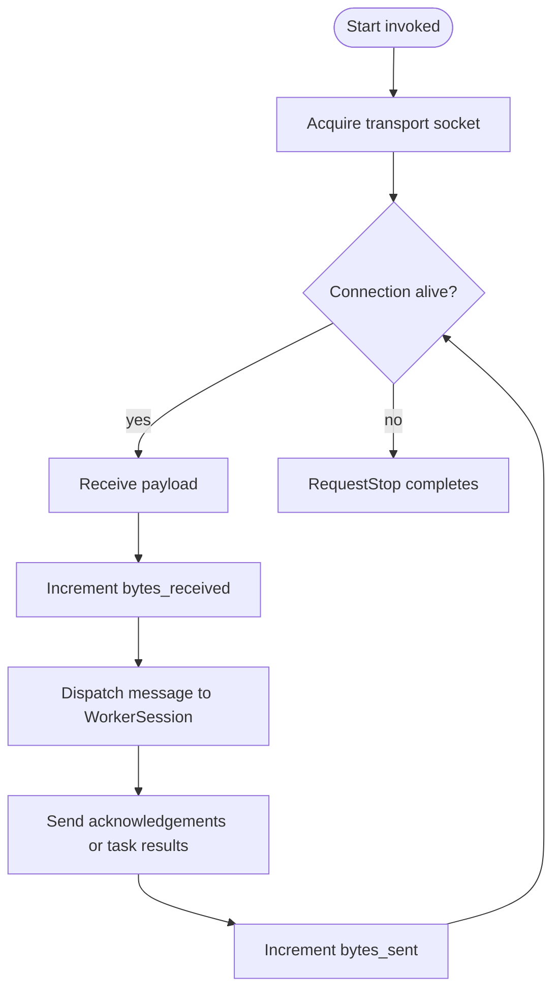

# Runtime Submodule

`worker/runtime` contains the pluggable I/O engines that implement `IRuntimeMode`. Runtimes own socket lifetimes, perform reads and writes, and surface lifecycle hooks (`Start`, `RequestStop`, `GetBytesSent`, `GetBytesReceived`).

Currently we ship two implementations:

- `BlockingRuntime`: simple `std::thread` + blocking sockets ideal for debugging.
- `AsyncRuntime`: coroutine-based runtime that integrates with the async transport primitives.

Both implementations share common responsibilities:

1. Establish the transport connection (using factories from `transport/`).
2. Pump control/messages between the manager and `WorkerSession`.
3. Track byte counters in atomic `uint64_t` members.
4. Surface status back to the session through callbacks or futures.

## Control Flow

- Byte counters wrap the actual send/receive calls (`SendRaw`, `RecvRaw`), guaranteeing that all payloads—including protocol-level acknowledgements—are considered.
- `RequestStop` flips the internal flag and notifies the loop to unwind cleanly, ensuring the socket closes before the session finalizes.

## Threading Model

| Runtime | Threading | Notes |
| --- | --- | --- |
| `BlockingRuntime` | Dedicated background thread | Safe to integrate into minimal environments or tests. |
| `AsyncRuntime` | Asynchronous tasks running on the coroutine scheduler | Reduces idle time when many workers are connected. |

Both variants expose the same `IRuntimeMode` API, so higher-level components do not need conditional logic.

## Byte Counter Access

`WorkerSession` queries the runtime for totals and normalizes them into formatted strings for UI/logging. If you add a new runtime, ensure the `bytes_sent_` and `bytes_received_` accumulators are updated alongside every I/O boundary so the metrics remain accurate.
