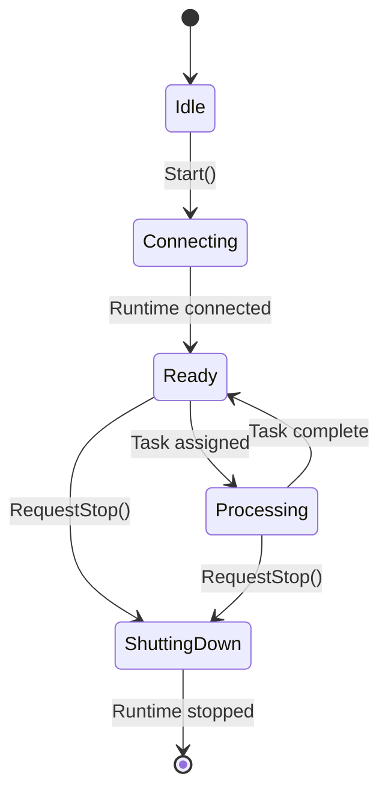

# Session Submodule

`worker/session` contains the orchestration logic that binds configuration, runtime selection, and task processing into a cohesive service. `WorkerSession` owns:

- The chosen `IRuntimeMode` implementation.
- A `TaskProcessor` instance responsible for executing scheduler-provided jobs.
- Aggregated metrics (task counts, byte counters, last-error reasons).
- Optional UI service wiring via `IWorkerService`.

## Lifecycle

- `Start()` configures the runtime and kicks off the connection attempt.
- Once the runtime signals readiness, `WorkerSession` accepts tasks and forwards them to the processor.
- Byte counters are polled whenever UI or logging sinks request status snapshots.
- `RequestStop()` is idempotent and safe to call regardless of the current state; it notifies the runtime and waits for completion.

## Responsibilities

1. Translate configuration objects into runtime factories and transport options.
2. Provide a thread-safe view of worker state for UI consumers (via `GetStatusSnapshot`).
3. Format byte totals using `format_bytes()` for human-readable strings.
4. Surface structured log messages when state transitions or errors occur.

## Adding New Capabilities

- Extend `WorkerSession::Status` if you need additional telemetry; keep types lightweight to avoid blocking UI refreshes.
- Update `GetStatusSnapshot()` and `format_bytes()` together so both raw and human-friendly metrics remain consistent.
- Avoid holding transport locks while executing arbitrary task code—delegate heavy lifting to `TaskProcessor` to preserve responsiveness.
