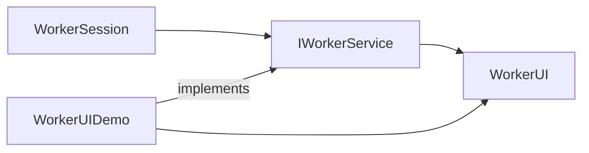

# UI Submodule

`worker/ui` offers the optional terminal dashboard built with FTXUI plus the service interface shared with the main worker. The UI is intentionally loosely coupled so the worker can run headless in production while still supporting rich local observability.

## Components

- `IWorkerService`: lightweight interface exposing lifecycle hooks (`Start`, `RequestStop`) and metrics accessors (task counts, byte totals).
- `WorkerUI`: FTXUI main loop that consumes `IWorkerService` snapshots and renders gauges, logs, and formatted byte totals.
- `WorkerUIDemo`: standalone executable (meson target `worker-ui-demo`) that exercises the UI without a manager connection.

## Data Flow



- During a real run, `WorkerSession` implements `IWorkerService`, allowing `WorkerUI` to poll live metrics through `GetStatusSnapshot()`.
- The demo provides a mock implementation that simulates task throughput and byte movement so UI features can be debugged offline.

## Running the UI

```powershell
meson configure builddir-worker -Dwith_ftxui=true
meson compile -C builddir-worker worker worker-ui-demo
./builddir-worker/worker/tm-worker.exe --ui
./builddir-worker/worker/worker-ui-demo.exe
```

- The worker tool automatically falls back to headless mode if FTXUI is unavailable or if `--ui` is omitted.
- `WorkerUI` uses the formatted byte strings supplied by `WorkerSession`, so any additional metrics should be exposed on the interface and rendered via FTXUI components.

## Extension Guidelines

1. Keep rendering logic inside `WorkerUI`; avoid embedding business rules in the UI layer.
2. Treat `IWorkerService` as the public contract—new UI panels should first extend the interface with minimal, thread-safe accessors.
3. Leverage FTXUI components (containers, graphs) to remain consistent with other UIs in the repository, mirroring the `transport` module's style.
